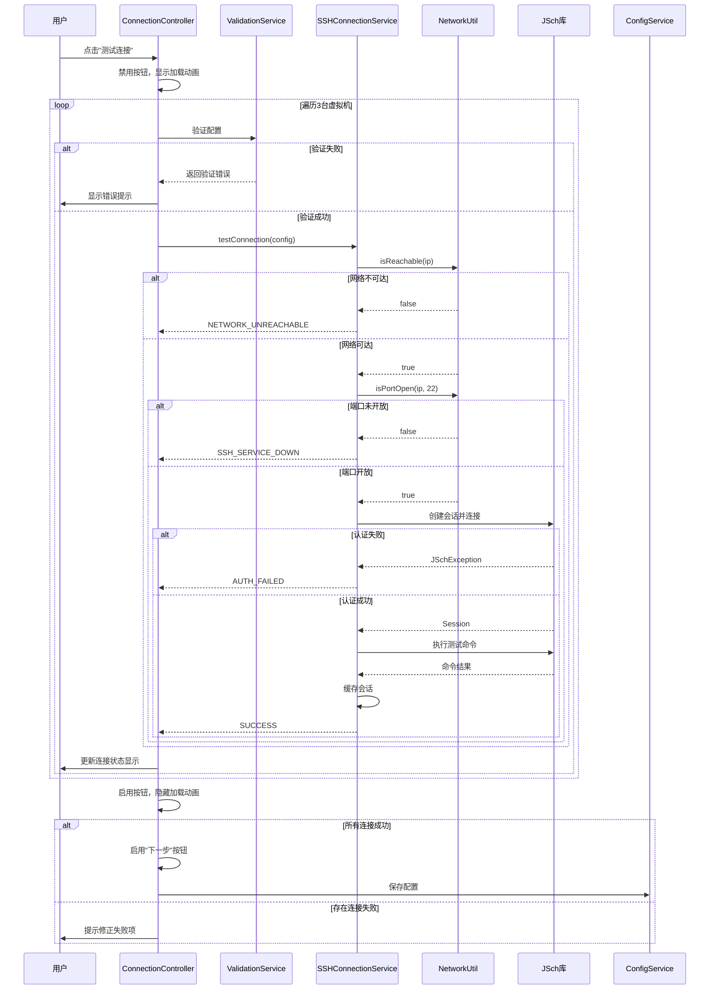
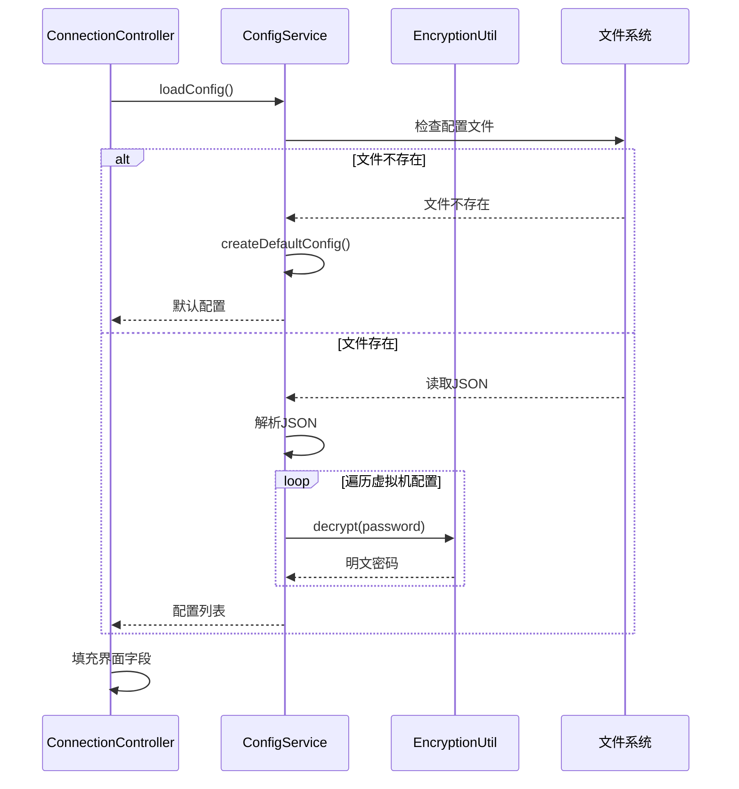

# 虚拟机远程连接功能设计文档

## 概述

虚拟机远程连接功能是HADS系统的基础模块，采用JavaFX构建图形界面，使用JSch库实现SSH远程连接。本模块遵循MVC架构模式，将界面展示、业务逻辑和数据模型清晰分离，确保代码的可维护性和可扩展性。

核心设计目标：
- 提供直观友好的连接配置界面
- 实现可靠的SSH连接管理
- 提供清晰的错误诊断和反馈
- 保障连接凭证的安全性

## 架构设计

### 整体架构

```
┌─────────────────────────────────────────────────────────┐
│                    JavaFX界面层                          │
│  ConnectionView.fxml + ConnectionController.java        │
└────────────────────┬────────────────────────────────────┘
                     │
                     ↓
┌─────────────────────────────────────────────────────────┐
│                    服务层                                │
│  ├─ SSHConnectionService (SSH连接管理)                  │
│  ├─ ValidationService (输入验证)                        │
│  └─ ConfigService (配置持久化)                          │
└────────────────────┬────────────────────────────────────┘
                     │
                     ↓
┌─────────────────────────────────────────────────────────┐
│                    数据模型层                            │
│  ├─ VMConnectionConfig (虚拟机连接配置)                 │
│  ├─ ConnectionResult (连接测试结果)                     │
│  └─ ConnectionStatus (连接状态枚举)                     │
└─────────────────────────────────────────────────────────┘
                     │
                     ↓
┌─────────────────────────────────────────────────────────┐
│                    工具层                                │
│  ├─ SSHUtil (SSH操作工具)                               │
│  ├─ EncryptionUtil (加密工具)                           │
│  └─ NetworkUtil (网络检测工具)                          │
└─────────────────────────────────────────────────────────┘
```

### 包结构设计

```
com.lyq
├── controller
│   └── ConnectionController.java          # 连接配置界面控制器
├── service
│   ├── SSHConnectionService.java          # SSH连接服务
│   ├── ValidationService.java             # 输入验证服务
│   └── ConfigService.java                 # 配置管理服务
├── model
│   ├── VMConnectionConfig.java            # 虚拟机连接配置模型
│   ├── ConnectionResult.java              # 连接测试结果模型
│   └── ConnectionStatus.java              # 连接状态枚举
├── util
│   ├── SSHUtil.java                       # SSH工具类
│   ├── EncryptionUtil.java                # 加密工具类
│   └── NetworkUtil.java                   # 网络工具类
└── exception
    ├── ConnectionException.java           # 连接异常
    └── ValidationException.java           # 验证异常
```

## 组件和接口设计

### 1. 界面层（Controller）

#### ConnectionController

**职责：** 处理用户交互，协调服务层完成连接配置和测试

**主要方法：**
```java
public class ConnectionController {
    // 初始化界面
    public void initialize();
    
    // 处理IP地址输入变化
    @FXML
    private void handleIpChange(ActionEvent event);
    
    // 处理密码显示切换
    @FXML
    private void handlePasswordToggle(ActionEvent event);
    
    // 处理测试连接按钮点击
    @FXML
    private void handleTestConnection(ActionEvent event);
    
    // 处理下一步按钮点击
    @FXML
    private void handleNext(ActionEvent event);
    
    // 加载保存的配置
    private void loadSavedConfig();
    
    // 更新连接状态显示
    private void updateConnectionStatus(int vmIndex, ConnectionResult result);
}
```

**FXML界面元素：**
- 3个TextField：vm1IpField, vm2IpField, vm3IpField（IP地址输入）
- 1个TextField：usernameField（用户名输入）
- 1个PasswordField：passwordField（密码输入）
- 1个Button：passwordToggleBtn（密码显示切换）
- 1个Button：testConnectionBtn（测试连接）
- 1个Button：nextBtn（下一步，初始禁用）
- 3个Label：vm1StatusLabel, vm2StatusLabel, vm3StatusLabel（连接状态显示）
- 3个Label：vm1ErrorLabel, vm2ErrorLabel, vm3ErrorLabel（错误信息显示）
- 1个ProgressIndicator：loadingIndicator（加载动画）

### 2. 服务层（Service）

#### SSHConnectionService

**职责：** 管理SSH连接的创建、测试和维护

**接口设计：**
```java
public class SSHConnectionService {
    // SSH会话缓存
    private Map<String, Session> sessionCache;
    
    // 测试单个虚拟机连接
    public ConnectionResult testConnection(VMConnectionConfig config);
    
    // 批量测试所有虚拟机连接
    public List<ConnectionResult> testAllConnections(List<VMConnectionConfig> configs);
    
    // 获取或创建SSH会话
    public Session getSession(VMConnectionConfig config) throws ConnectionException;
    
    // 关闭指定会话
    public void closeSession(String vmIp);
    
    // 关闭所有会话
    public void closeAllSessions();
    
    // 执行远程命令（用于连接验证）
    public String executeCommand(Session session, String command) throws ConnectionException;
    
    // 自动重连
    private Session reconnect(VMConnectionConfig config, int maxRetries);
}
```

**连接测试流程：**
1. 网络可达性检测（ping或socket连接）
2. SSH端口检测（默认22端口）
3. SSH认证（用户名密码）
4. 执行简单命令验证（如：echo "test"）
5. 返回连接结果

#### ValidationService

**职责：** 验证用户输入的合法性

**接口设计：**
```java
public class ValidationService {
    // 验证IP地址格式
    public ValidationResult validateIpAddress(String ip);
    
    // 验证用户名格式
    public ValidationResult validateUsername(String username);
    
    // 验证密码强度（可选）
    public ValidationResult validatePassword(String password);
    
    // 验证完整配置
    public ValidationResult validateConfig(VMConnectionConfig config);
    
    // IP地址格式正则表达式
    private static final String IP_PATTERN = 
        "^((25[0-5]|2[0-4][0-9]|[01]?[0-9][0-9]?)\\.){3}(25[0-5]|2[0-4][0-9]|[01]?[0-9][0-9]?)$";
}
```

#### ConfigService

**职责：** 管理连接配置的持久化

**接口设计：**
```java
public class ConfigService {
    // 配置文件路径
    private static final String CONFIG_PATH = System.getProperty("user.home") + "/.hads/config.json";
    
    // 保存连接配置
    public void saveConfig(List<VMConnectionConfig> configs) throws IOException;
    
    // 加载连接配置
    public List<VMConnectionConfig> loadConfig() throws IOException;
    
    // 检查配置文件是否存在
    public boolean configExists();
    
    // 创建默认配置
    public List<VMConnectionConfig> createDefaultConfig();
    
    // 加密密码
    private String encryptPassword(String password);
    
    // 解密密码
    private String decryptPassword(String encryptedPassword);
}
```

**配置文件格式（JSON）：**
```json
{
  "version": "1.0",
  "vms": [
    {
      "index": 1,
      "ip": "192.168.10.101",
      "hostname": "hadoop101",
      "username": "root",
      "password": "encrypted_password_here"
    },
    {
      "index": 2,
      "ip": "192.168.10.102",
      "hostname": "hadoop102",
      "username": "root",
      "password": "encrypted_password_here"
    },
    {
      "index": 3,
      "ip": "192.168.10.103",
      "hostname": "hadoop103",
      "username": "root",
      "password": "encrypted_password_here"
    }
  ],
  "lastModified": "2025-11-10T10:30:00"
}
```

### 3. 数据模型层（Model）

#### VMConnectionConfig

**职责：** 封装单个虚拟机的连接配置信息

```java
public class VMConnectionConfig {
    private int index;              // 虚拟机编号（1-3）
    private String ip;              // IP地址
    private String hostname;        // 主机名
    private String username;        // 用户名
    private String password;        // 密码（内存中加密）
    private int sshPort;            // SSH端口（默认22）
    private int timeout;            // 连接超时时间（默认30秒）
    
    // Getter和Setter方法
    // 构造函数
    // toString方法（密码脱敏）
}
```

#### ConnectionResult

**职责：** 封装连接测试的结果信息

```java
public class ConnectionResult {
    private int vmIndex;                    // 虚拟机编号
    private String vmIp;                    // 虚拟机IP
    private ConnectionStatus status;        // 连接状态
    private String message;                 // 结果消息
    private String errorDetail;             // 错误详情
    private long responseTime;              // 响应时间（毫秒）
    private LocalDateTime testTime;         // 测试时间
    
    // 工厂方法
    public static ConnectionResult success(int vmIndex, String vmIp, long responseTime);
    public static ConnectionResult failure(int vmIndex, String vmIp, String errorDetail);
}
```

#### ConnectionStatus（枚举）

**职责：** 定义连接状态类型

```java
public enum ConnectionStatus {
    NOT_TESTED("未测试"),
    TESTING("测试中"),
    SUCCESS("连接成功"),
    NETWORK_UNREACHABLE("网络不可达"),
    SSH_SERVICE_DOWN("SSH服务未启动"),
    AUTH_FAILED("认证失败"),
    TIMEOUT("连接超时"),
    UNKNOWN_ERROR("未知错误");
    
    private final String description;
    
    ConnectionStatus(String description) {
        this.description = description;
    }
    
    public String getDescription() {
        return description;
    }
}
```

### 4. 工具层（Util）

#### SSHUtil

**职责：** 提供SSH操作的底层工具方法

```java
public class SSHUtil {
    // 创建SSH会话
    public static Session createSession(String host, int port, String username, String password) 
        throws JSchException;
    
    // 执行命令
    public static String executeCommand(Session session, String command) 
        throws JSchException, IOException;
    
    // 检查会话是否连接
    public static boolean isSessionConnected(Session session);
    
    // 安全关闭会话
    public static void closeSession(Session session);
    
    // 配置JSch属性
    private static void configureJSch(JSch jsch);
}
```

#### EncryptionUtil

**职责：** 提供密码加密解密功能

```java
public class EncryptionUtil {
    private static final String ALGORITHM = "AES";
    private static final String TRANSFORMATION = "AES/CBC/PKCS5Padding";
    private static final int KEY_SIZE = 256;
    
    // 加密密码
    public static String encrypt(String plainText) throws Exception;
    
    // 解密密码
    public static String decrypt(String encryptedText) throws Exception;
    
    // 生成密钥
    private static SecretKey generateKey() throws Exception;
    
    // 获取或创建密钥（存储在本地）
    private static SecretKey getOrCreateKey() throws Exception;
}
```

#### NetworkUtil

**职责：** 提供网络检测工具方法

```java
public class NetworkUtil {
    // 检查IP是否可达（ICMP ping）
    public static boolean isReachable(String ip, int timeout);
    
    // 检查端口是否开放
    public static boolean isPortOpen(String ip, int port, int timeout);
    
    // 获取本机IP地址
    public static String getLocalIpAddress();
    
    // 验证IP格式
    public static boolean isValidIpAddress(String ip);
}
```

### 5. 异常处理

#### ConnectionException

**职责：** 封装连接相关的异常

```java
public class ConnectionException extends Exception {
    private ConnectionStatus status;
    private String vmIp;
    
    public ConnectionException(String message, ConnectionStatus status, String vmIp) {
        super(message);
        this.status = status;
        this.vmIp = vmIp;
    }
    
    public ConnectionException(String message, Throwable cause, ConnectionStatus status, String vmIp) {
        super(message, cause);
        this.status = status;
        this.vmIp = vmIp;
    }
    
    // Getter方法
}
```

#### ValidationException

**职责：** 封装验证相关的异常

```java
public class ValidationException extends Exception {
    private String fieldName;
    private String invalidValue;
    
    public ValidationException(String message, String fieldName, String invalidValue) {
        super(message);
        this.fieldName = fieldName;
        this.invalidValue = invalidValue;
    }
    
    // Getter方法
}
```

## 数据流设计

### 连接测试流程



### 配置加载流程



## 错误处理策略

### 错误分类和处理

| 错误类型 | 检测方式 | 用户提示 | 处理策略 |
|---------|---------|---------|---------|
| IP格式错误 | 正则表达式验证 | "IP地址格式不正确，请输入有效的IPv4地址" | 阻止提交，红色边框提示 |
| 网络不可达 | InetAddress.isReachable() | "网络不通，请检查IP地址和网络配置" | 显示错误状态，允许重试 |
| SSH服务未启动 | Socket端口检测 | "SSH服务未启动，请在虚拟机中启动sshd服务" | 显示错误状态，提供帮助链接 |
| 认证失败 | JSch异常捕获 | "用户名或密码错误，请检查登录凭证" | 显示错误状态，允许修改 |
| 连接超时 | 超时异常捕获 | "连接超时，请检查网络状态和防火墙设置" | 显示错误状态，允许重试 |
| 配置文件损坏 | JSON解析异常 | "配置文件损坏，将使用默认配置" | 使用默认配置，记录日志 |

### 异常处理原则

1. **用户友好**：所有错误信息使用自然语言，避免技术术语
2. **具体明确**：指出具体的虚拟机和错误原因
3. **可操作性**：提供解决建议或重试选项
4. **日志记录**：所有异常记录到日志文件，便于排查
5. **优雅降级**：部分功能失败不影响整体使用

## 测试策略

### 单元测试

**测试范围：**
- ValidationService的所有验证方法
- EncryptionUtil的加密解密功能
- NetworkUtil的网络检测方法
- ConfigService的配置读写功能

**测试工具：** JUnit 4

**测试覆盖率目标：** ≥80%

### 集成测试

**测试场景：**
1. 正常连接流程：输入正确配置 → 测试连接 → 所有成功
2. 网络异常场景：输入不可达IP → 测试连接 → 显示网络错误
3. 认证失败场景：输入错误密码 → 测试连接 → 显示认证错误
4. 配置持久化：保存配置 → 重启应用 → 自动加载配置
5. 部分失败场景：3台虚拟机中1台失败 → 显示具体失败信息

### 界面测试

**测试要点：**
- 输入框实时验证反馈
- 按钮状态正确切换
- 加载动画正确显示
- 错误提示清晰可见
- 响应时间≤1秒

## 性能考虑

### 响应时间优化

1. **异步连接测试**：使用JavaFX Task在后台线程执行连接测试，避免阻塞UI
2. **并行测试**：3台虚拟机的连接测试并行执行，减少总耗时
3. **会话复用**：成功的SSH会话缓存复用，避免重复连接
4. **超时控制**：设置合理的连接超时时间（30秒），避免长时间等待

### 资源管理

1. **会话管理**：及时关闭不用的SSH会话，释放资源
2. **内存优化**：敏感信息使用后及时清除
3. **线程池**：使用线程池管理后台任务，避免线程泄漏

## 安全设计

### 密码安全

1. **传输安全**：SSH协议本身提供加密传输
2. **存储安全**：配置文件中的密码使用AES-256加密
3. **内存安全**：密码在内存中加密存储，使用后清除
4. **日志安全**：日志中密码自动脱敏为"***"

### 密钥管理

1. **密钥生成**：首次运行时自动生成AES密钥
2. **密钥存储**：密钥存储在用户目录的.hads/keys/目录
3. **密钥权限**：密钥文件设置为仅当前用户可读

### 连接安全

1. **主机验证**：首次连接时记录主机指纹，后续验证
2. **会话超时**：长时间不活动的会话自动断开
3. **重连限制**：自动重连最多3次，避免暴力尝试

## 依赖管理

### Maven依赖

需要在pom.xml中添加以下依赖：

```xml
<!-- JSch SSH库 -->
<dependency>
    <groupId>com.jcraft</groupId>
    <artifactId>jsch</artifactId>
    <version>0.1.55</version>
</dependency>

<!-- JavaFX -->
<dependency>
    <groupId>org.openjfx</groupId>
    <artifactId>javafx-controls</artifactId>
    <version>17.0.2</version>
</dependency>
<dependency>
    <groupId>org.openjfx</groupId>
    <artifactId>javafx-fxml</artifactId>
    <version>17.0.2</version>
</dependency>

<!-- JSON处理 -->
<dependency>
    <groupId>com.google.code.gson</groupId>
    <artifactId>gson</artifactId>
    <version>2.10.1</version>
</dependency>

<!-- Log4j2 -->
<dependency>
    <groupId>org.apache.logging.log4j</groupId>
    <artifactId>log4j-core</artifactId>
    <version>2.20.0</version>
</dependency>
<dependency>
    <groupId>org.apache.logging.log4j</groupId>
    <artifactId>log4j-api</artifactId>
    <version>2.20.0</version>
</dependency>
```

## 界面设计规范

### 布局设计

- 使用VBox作为主容器，垂直排列各个配置区域
- 每台虚拟机的配置使用HBox水平排列（标签 + 输入框 + 状态图标）
- 按钮区域使用HBox右对齐
- 整体使用GridPane实现对齐

### 样式规范

- 输入框宽度：200px
- 按钮高度：35px
- 间距：10px
- 错误提示颜色：#D32F2F（红色）
- 成功提示颜色：#388E3C（绿色）
- 警告提示颜色：#F57C00（橙色）

### 交互反馈

- 输入框获得焦点：蓝色边框
- 输入错误：红色边框 + 错误图标
- 连接成功：绿色对勾图标
- 连接失败：红色叉号图标
- 测试中：旋转的加载动画

## 扩展性考虑

### 未来扩展点

1. **支持更多虚拟机**：当前固定3台，未来可支持动态添加
2. **支持密钥认证**：当前仅支持密码，未来可支持SSH密钥
3. **连接配置模板**：支持保存多套连接配置，快速切换
4. **批量导入**：支持从CSV或Excel导入虚拟机配置
5. **连接诊断工具**：提供更详细的网络诊断功能

### 设计原则

- **单一职责**：每个类只负责一个功能
- **开闭原则**：对扩展开放，对修改关闭
- **依赖注入**：服务类通过构造函数注入，便于测试
- **接口隔离**：定义清晰的服务接口
- **面向接口编程**：依赖抽象而非具体实现
